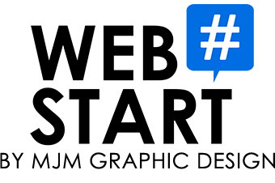

# Webstart PHP framework

> For demonstration purpose only

A simple example of a PHP framework made for Webstart school.



## Install

```bash
$ composer install
```

Set up env variables by copying and setting `.env.example` file contents in a `.env` file.

## Usage

```bash
$ php -S 0.0.0.0:8080 -t public/
# or
$ composer run serve
```

## Features

* `.env` file
* Carbon for dates

### Dev

* Whoops error
* Faker